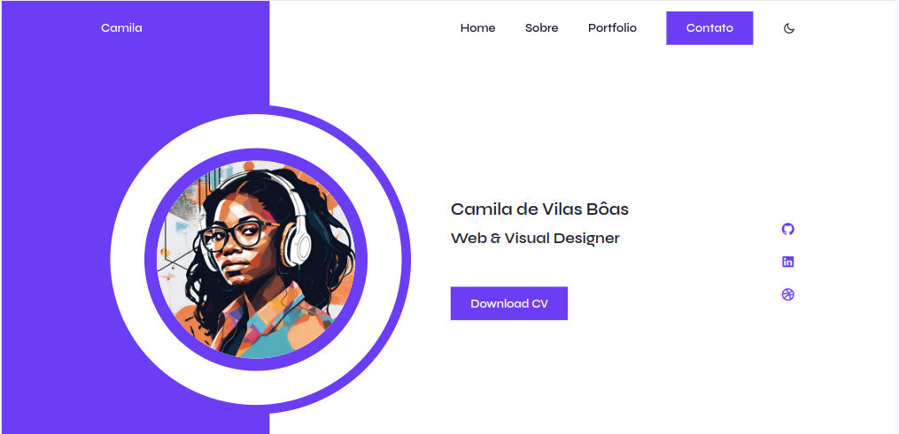

# Responsive Portfolio Website 
## [Link da página] https://devilasboas.github.io/Portfolio-Website/
### Responsive Portfolio Website

- Site de portfólio pessoal responsivo usando HTML, CSS e JavaScript.
- Contém várias páginas (Sobre, Trabalho e Contato).
- Inclui um tema escuro e claro.
- Envio de e-mails na seção de contato.
- Desenvolvido primeiro com a metodologia Mobile First, depois para desktop.
- Compatível com todos os dispositivos móveis e com uma interface de usuário bonita e agradável.

